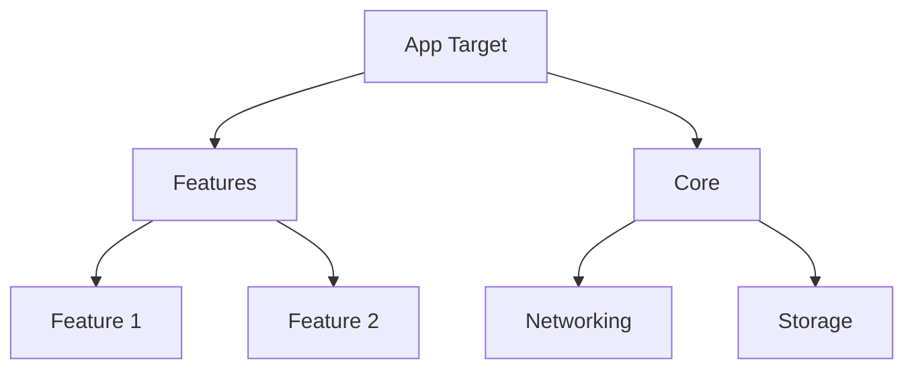
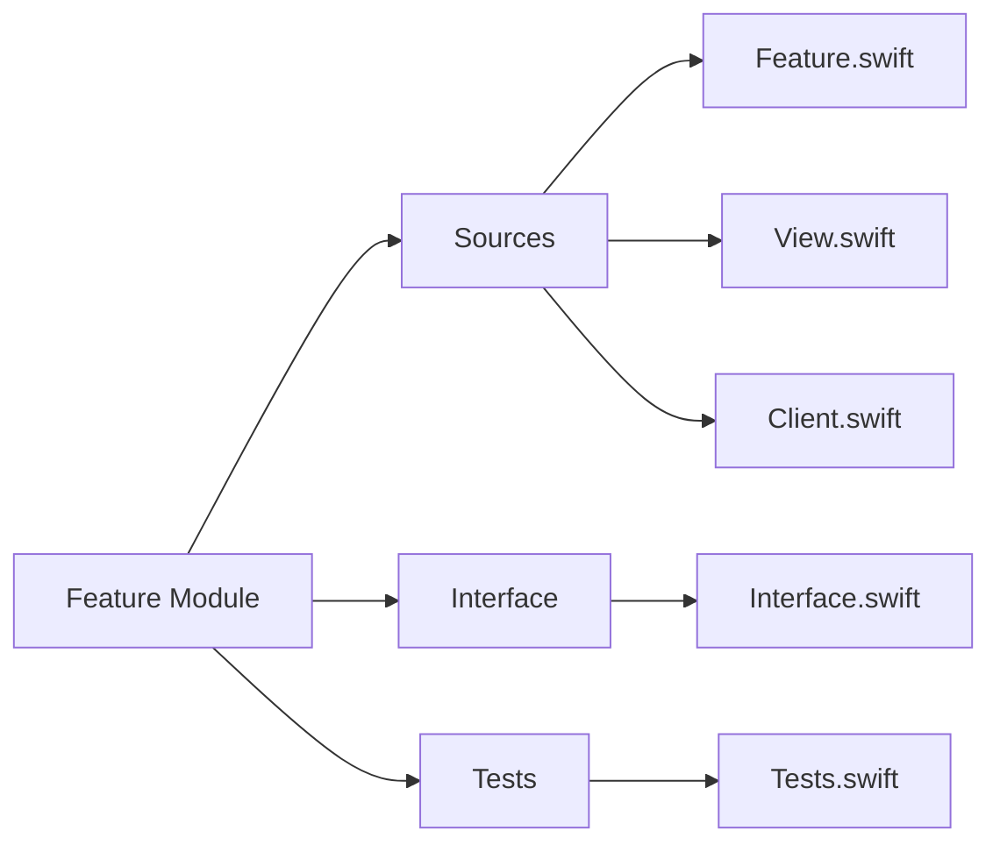

# iOS Project Boilerplate with Tuist and TCA

A ready-to-use template for building iOS apps using:
- Tuist for project generation and management
- The Composable Architecture (TCA) for state management
- SwiftUI for UI development

## What's Inside

This template helps you:
- Set up a modular iOS project structure
- Create new features quickly using TCA patterns
- Keep your codebase organized and maintainable

## Project Structure


## Quick Start

1. Install dependencies:
```bash
mise install
tuist install
```

2. Generate Xcode project:
```bash
tuist generate
```

3. Create a new feature:
```bash
tuist scaffold feature --name YourFeatureName
```

## Adding Features

1. Generate a feature module:
```bash
tuist scaffold feature --name YourFeatureName
```

2. Add it to your app in Project.swift:
```swift
import ProjectDescription

let project = Project(
  name: "YourApp",
  targets: [
    .target(
      name: "YourApp",
      dependencies: [
        .project(target: "YourFeatureName", path: .relative("Features/YourFeatureName"))
      ]
    )
  ]
)
```

3. Use the feature in your app:
```swift
import YourFeatureName

struct ContentView: View {
  var body: some View {
    YourFeatureNameView(
      store: Store(initialState: YourFeatureNameFeature.State()) {
        YourFeatureNameFeature()
      }
    )
  }
}
```

## Feature Template Structure

Each feature follows this structure:



This organized structure helps keep your code clean and testable.
