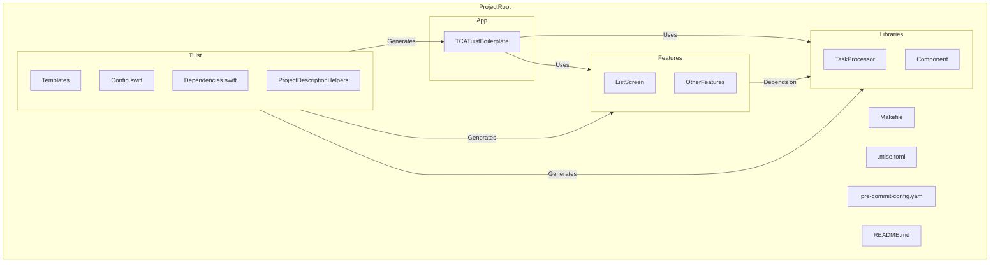

# iOS Project Template with Tuist and The Composable Architecture (TCA)

An advanced, ready-to-use template for iOS applications, leveraging **Tuist** for scalable project management and **The Composable Architecture (TCA)** for robust state management. This template provides a modular and testable architecture, making it easier to build, maintain, and scale your iOS applications.

## Table of Contents
- [Overview](#overview)
- [Project Structure](#project-structure)
- [Tools and Technologies](#tools-and-technologies)
  - [Tuist](#tuist)
  - [The Composable Architecture (TCA)](#the-composable-architecture-tca)
  - [Mise](#mise)
  - [Swift Package Manager](#swift-package-manager)
  - [Pre-commit Hooks](#pre-commit-hooks)
- [Getting Started](#getting-started)
  - [Prerequisites](#prerequisites)
  - [Setup](#setup)
- [Feature Module Template](#feature-module-template)
  - [Using the Template](#using-the-template)
  - [Feature Module Structure](#feature-module-structure)
- [Common Tasks](#common-tasks)
- [Tips](#tips)
- [Contributing](#contributing)
- [License](#license)

## Overview

This template provides a solid foundation for developing iOS applications with a focus on scalability and maintainability. It utilizes **Tuist** to manage complex Xcode projects and **The Composable Architecture (TCA)** for predictable state management using SwiftUI. The project is structured to encourage modularity, making it easy to develop, test, and reuse features.

## Project Structure

The project is organized into several key directories and modules to promote modularity, testability, and scalability.

### High-level Structure

```plaintext
ProjectRoot/
├── TCATuistBoilerplate/      # Main app target
│   ├── Sources/              # App's source code
│   └── Resources/            # Assets, storyboards, etc.
├── Features/                 # Feature modules
│   ├── ListScreen/           # Example feature module
│   │   ├── Sources/          # Implementation code
│   │   ├── Interface/        # Public API and models
│   │   ├── Testing/          # Test utilities and mocks
│   │   └── Tests/            # Unit and snapshot tests
│   └── [OtherFeatures]/      # Additional features
├── Libraries/                # Reusable libraries and components
│   ├── TaskProcessor/        # Async task processing library
│   └── Component/            # Reusable UI components
├── Tuist/                    # Project generation configuration
│   ├── Templates/            # Templates for scaffolding
│   ├── Config.swift          # Global configuration
│   ├── Dependencies.swift    # SwiftPM dependencies
│   └── ProjectDescriptionHelpers/ # Shared helpers
├── Makefile                  # Common tasks automation
├── .mise.toml                # Tool version management
├── .pre-commit-config.yaml   # Pre-commit hooks configuration
└── README.md                 # Project documentation
```

### Project Structure Diagram

Here's a Mermaid diagram representing the high-level project structure:



- **App (TCATuistBoilerplate)**: The main application target, responsible for app-level configurations and integrating features.
- **Features**: Independent, modular feature modules that encapsulate their own logic, views, and state management.
- **Libraries**: Reusable components and utilities that can be shared across features and the main app.
- **Tuist**: Contains configuration and templates for project generation and management using Tuist.
- **Makefile**, **.mise.toml**, **.pre-commit-config.yaml**: Tools for automating tasks, managing tool versions, and enforcing code quality standards.

### Modules and Components

#### TCATuistBoilerplate/

This directory contains the main application target.

- **Sources/**: The main app's Swift code, including the `App` struct and entry point.
- **Resources/**: Assets, storyboards, and other resource files.

#### Features/

Contains independent feature modules, each following a consistent structure.

##### Example: ListScreen/

```plaintext
ListScreen/
├── Project.swift                # Tuist project configuration
├── Interface/                   # Public API (e.g., clients, models)
│   ├── ListScreenClient.swift
│   └── ListScreenModels.swift
├── Sources/                     # Implementation of the feature
│   ├── ListScreenFeature.swift      # TCA reducer and logic
│   ├── ListScreenView.swift         # SwiftUI view
│   ├── ListScreenItemView.swift     # Subview for list items
│   ├── ListScreenAddItemFeature.swift # Add item functionality
│   ├── ListScreenEditItemFeature.swift # Edit item functionality
│   └── LiveListScreenClient.swift     # Live implementation of the client
├── Testing/                     # Testing utilities and mocks
│   └── ListScreenTesting.swift
└── Tests/                       # Unit and snapshot tests
    ├── ListScreenTests.swift
    └── ListScreenSnapshotTests.swift
```

**Key Concepts in ListScreen**:

- **State Management**: Uses TCA to manage state in a predictable way.
- **Dependency Injection**: Clients like `ListScreenClient` are injected, allowing for easy testing and mocking.
- **Modularity**: The feature is self-contained, promoting reusability.
- **Testing**: Includes unit tests and snapshot tests to validate functionality and UI.

#### Libraries/

Reusable components and utilities that can be shared across features.

##### Example: TaskProcessor/

```plaintext
TaskProcessor/
├── Project.swift              # Tuist project configuration
├── Interface/                 # Public API
│   ├── TaskProcessorClient.swift
│   ├── TaskProcessorModels.swift
│   └── TaskProcessorOperation.swift
├── Sources/                   # Implementation
│   ├── LiveTaskProcessorClient.swift
│   └── TaskManager.swift
└── Tests/
    └── TaskProcessorTests.swift
```

**Key Concepts in TaskProcessor**:

- **Concurrency**: Uses Swift concurrency (`async`/`await`) to handle asynchronous tasks.
- **Real-time Progress Tracking**: Provides progress updates via `AsyncStream`.
- **Task Control**: Allows tasks to be paused, resumed, or cancelled.
- **Testing**: Includes comprehensive tests to ensure correct behavior.

#### Tuist/

Contains configurations and templates for project generation.

- **Templates/**: Custom templates for scaffolding new features and libraries.
- **Config.swift**: Global configuration for Tuist.
- **Dependencies.swift**: Swift Package Manager dependencies.
- **ProjectDescriptionHelpers/**: Shared helpers and settings.

### Build Automation and Tooling

#### Makefile

Provides common `make` commands for tasks like bootstrapping the environment, generating the project, running tests, formatting code, etc.

#### .mise.toml

Configuration file for Mise, managing specific tool versions used in the project (e.g., SwiftLint, SwiftFormat, Tuist versions).

#### .pre-commit-config.yaml

Defines pre-commit hooks using the `pre-commit` framework to automatically format code and check for code quality issues before commits.

## Tools and Technologies

### Tuist

[**Tuist**](https://tuist.io/) is a command-line tool that helps you maintain and scale Xcode projects. It allows you to define your project structure in Swift using `Project.swift` files and provides various benefits:

- **Pros**:
  - Simplifies project generation and configuration.
  - Encourages modularity and code reuse.
  - Allows for project templates and scaffolding.
  - Version control friendly since project settings are code and not binary files.

- **Cons**:
  - Requires learning the Tuist domain-specific language.
  - Adds an additional build step (project generation).

### The Composable Architecture (TCA)

[**TCA**](https://github.com/pointfreeco/swift-composable-architecture) is a library for building applications in a consistent and understandable way, using unidirectional data flow, mutation, and side effects.

- **Pros**:
  - Provides a predictable state management pattern.
  - Facilitates testing by isolating side effects.
  - Encourages modularity and code reuse.

- **Cons**:
  - Introduces a learning curve due to its functional programming concepts.
  - Can add boilerplate code for small features.

### Mise

[**Mise**](https://mise.jdx.dev/) is a tool that manages tool versions and provides a consistent environment across development machines.

- **Pros**:
  - Ensures all developers use the same tool versions.
  - Simplifies environment setup for new developers.

- **Cons**:
  - Additional tool to install and manage.

### Swift Package Manager (SwiftPM)

Used for dependency management, SwiftPM integrates third-party libraries into the project.

- **Pros**:
  - Integrated into the Swift toolchain.
  - Provides a standard way to manage dependencies.

- **Cons**:
  - Limited support for binary dependencies and resources compared to other managers like CocoaPods.

### Pre-commit Hooks

The project includes pre-commit hooks for code formatting and linting using [SwiftLint](https://github.com/realm/SwiftLint) and [SwiftFormat](https://github.com/nicklockwood/SwiftFormat).

- **Pros**:
  - Enforces code style and quality.
  - Catches issues before code is committed.

- **Cons**:
  - Requires setup and can reject commits if not configured properly.

## Getting Started

### Prerequisites

- **Xcode 15** or later.
- **macOS 13** or later.
- **[Mise](https://mise.jdx.dev/)** installed.
- **[Pre-commit](https://pre-commit.com/)** installed.

### Setup

1. **Install Mise and Project Dependencies**

   Install **Mise** to manage tool versions and project dependencies:

   ```bash
   # Install Mise (manages tool versions)
   curl https://mise.jdx.dev/install.sh | sh

   # Install project dependencies
   make bootstrap
   ```

2. **Generate the Xcode Project**

   Use the `make` command to generate the Xcode workspace using Tuist:

   ```bash
   make generate
   ```

3. **Open the Project**

   Open the generated `.xcodeproj` or `.xcworkspace` file in Xcode.

4. **Install Pre-commit Hooks**

   Install and set up pre-commit hooks for code formatting and linting:

   ```bash
   pip install pre-commit
   pre-commit install
   ```

## Feature Module Template

The project includes a **Tuist template** for generating feature modules. This template streamlines the creation of new features, ensuring consistency and adherence to the project's architecture.

### Using the Template

1. **Generate a New Feature Module**

   Use the `tuist scaffold` command to create a new feature module:

   ```bash
   tuist scaffold list_feature --name YourFeature
   ```

   This will create a new feature module at `Features/YourFeature/` with the following structure:

   ```plaintext
   YourFeature/
   ├── Project.swift
   ├── Interface/
   ├── Sources/
   ├── Testing/
   └── Tests/
   ```

2. **Update Main App Dependencies**

   Add your new feature to the main app's dependencies in `TCATuistBoilerplate/Project.swift`:

   ```swift
   import ProjectDescription
   import ProjectDescriptionHelpers

   let project = Project(
     name: "TCATuistBoilerplate",
     targets: [
       .app(
         name: "TCATuistBoilerplate",
         platforms: [.iOS],
         //...
         dependencies: [
           .project(target: "YourFeature", path: "../Features/YourFeature"),
           // Other dependencies...
         ]
       )
     ]
   )
   ```

3. **Implement Your Feature**

   - **Sources/**: Write your feature's logic and views.
   - **Interface/**: Define public interfaces and models.
   - **Tests/**: Write unit and snapshot tests.
   - **Testing/**: Include test utilities and mocks.

### Feature Module Structure

```plaintext
YourFeature/
├── Project.swift           # Feature module configuration
├── Interface/              # Public API and models
│   ├── YourFeatureClient.swift
│   └── YourFeatureModels.swift
├── Sources/                # Implementation code
│   ├── YourFeatureFeature.swift
│   ├── YourFeatureView.swift
│   ├── YourFeatureItemView.swift
│   ├── YourFeatureAddItemFeature.swift
│   ├── YourFeatureEditItemFeature.swift
│   └── LiveYourFeatureClient.swift
├── Testing/                # Test utilities and mocks
│   └── YourFeatureTesting.swift
└── Tests/                  # Unit and snapshot tests
    ├── YourFeatureTests.swift
    └── YourFeatureSnapshotTests.swift
```

## Common Tasks

### Update Dependencies

To update project dependencies (including Tuist and SwiftPM packages):

```bash
make update
```

### Run Tests

Run all tests:

```bash
make test
```

Run only unit tests:

```bash
make unit_test
```

### Format Code

Format all Swift code using SwiftFormat and SwiftLint:

```bash
make format
```

### Lint Code

Check code style and issues without fixing:

```bash
make lint
```

### Clean Build Files

Clean the project's build artifacts:

```bash
make clean
```

### Cache External Dependencies

Cache external dependencies to speed up build times:

```bash
make cache
```

## Tips

- **Use Mise for Consistent Environments**: Mise ensures that all developers use the same versions of tools, which helps prevent inconsistencies and "works on my machine" issues.
- **Modularize Your Code**: Keep your features and components modular. This makes your codebase more maintainable and testable.
- **Write Tests Early**: Leverage TCA's testability to write unit and integration tests as you develop new features.
- **Leverage Tuist Templates**: Use the provided Tuist templates to scaffold new features and components. This ensures consistency across your codebase.
- **Use Pre-commit Hooks**: Install and configure pre-commit hooks to enforce code quality standards automatically.
- **Understand TCA Concepts**: Familiarize yourself with reducers, actions, state, and effects in TCA to effectively implement features.
- **Regularly Update Dependencies**: Keep your dependencies up to date to benefit from the latest features and bug fixes.
- **Document Your Code**: Maintain clear documentation within your code to make it easier for others (and future you) to understand.

## Contributing

Contributions are welcome! Please follow these steps to contribute:

1. **Fork the Repository**: Create a personal fork of the repository on GitHub.

2. **Create a Feature Branch**: Make your changes in a new branch.

   ```bash
   git checkout -b feature/your-feature
   ```

3. **Commit Your Changes**: Ensure your commits are well-documented.

4. **Open a Pull Request**: Submit your changes for review.

5. **Code Review**: Participate in the review process and make any necessary changes.

## License

This project is licensed under the MIT License. See the [LICENSE](LICENSE) file for details.

## Additional Resources

- **Tuist Documentation**: [https://docs.tuist.io/](https://docs.tuist.io/)
- **The Composable Architecture**: [https://github.com/pointfreeco/swift-composable-architecture](https://github.com/pointfreeco/swift-composable-architecture)
- **Mise Documentation**: [https://mise.jdx.dev/](https://mise.jdx.dev/)
- **SwiftLint**: [https://github.com/realm/SwiftLint](https://github.com/realm/SwiftLint)
- **SwiftFormat**: [https://github.com/nicklockwood/SwiftFormat](https://github.com/nicklockwood/SwiftFormat)
- **Pre-commit**: [https://pre-commit.com/](https://pre-commit.com/)

## Conclusion

This template serves as a strong foundation for building robust, scalable, and maintainable iOS applications. By leveraging the power of Tuist and TCA, you can streamline your development process and focus on delivering value to your users. Happy coding!

---

Feel free to customize and expand upon this README to suit your project's specific needs. If you have any questions or need further assistance, don't hesitate to ask!
